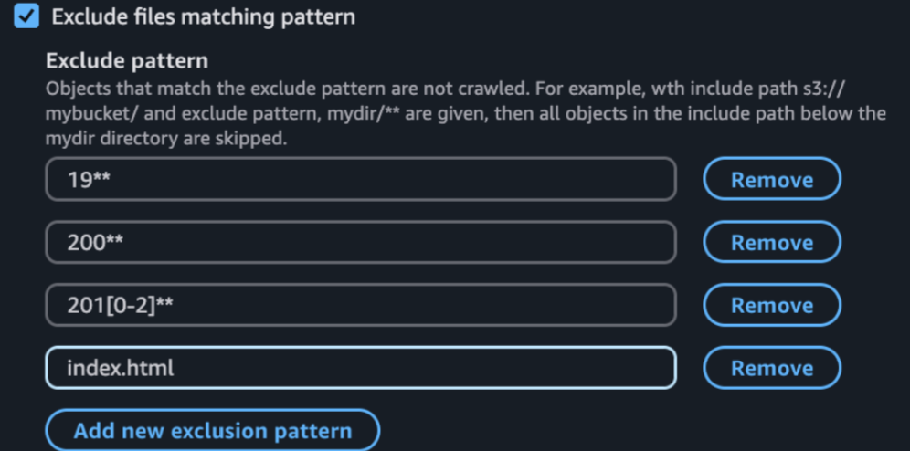
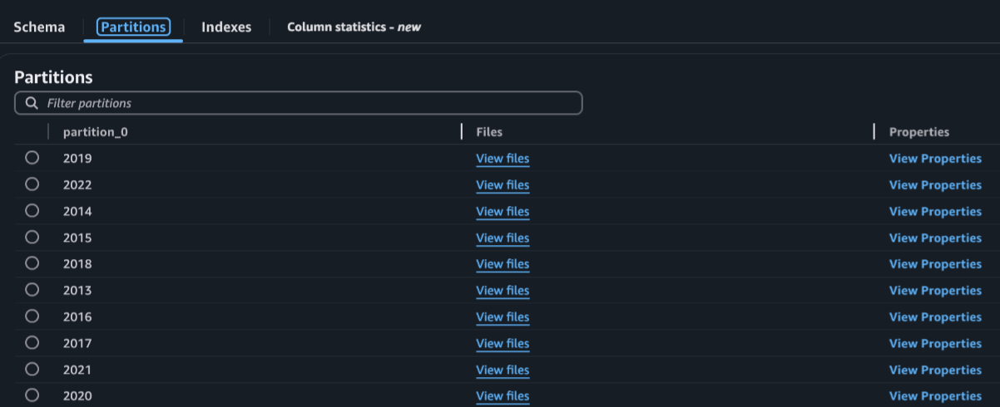
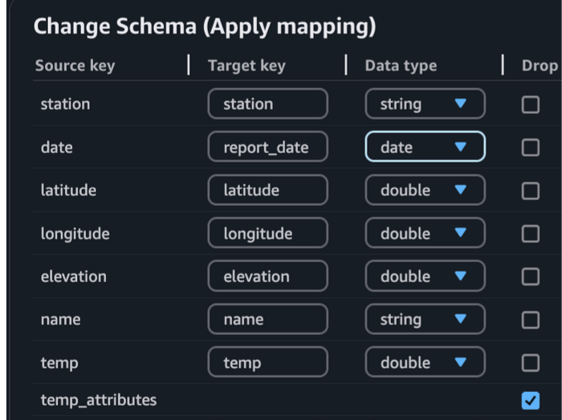
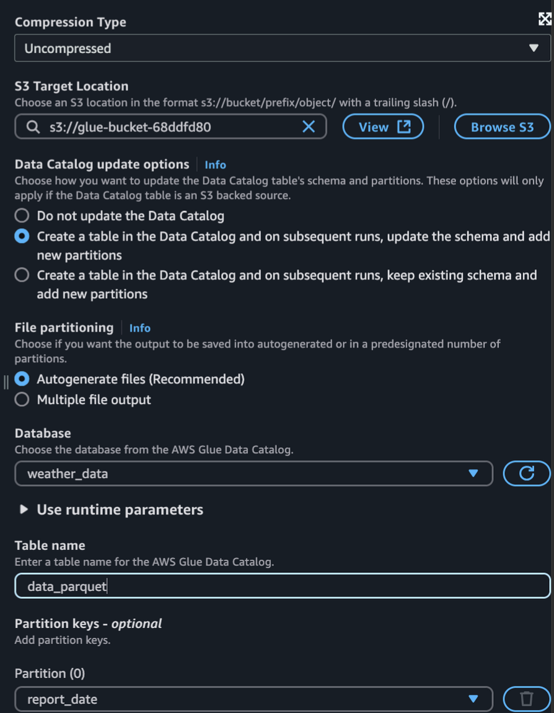

# AWS Glue ETL Project: NOAA Weather Data Aggregation

## Project Overview

This project demonstrates a serverless ETL pipeline built using **AWS Glue** to process and analyze weather data from the **National Oceanic and Atmospheric Administration (NOAA)**. The goal is to extract average precipitation and temperature data across specific time periods.

Key components include:
- Crawling and cataloging raw S3 data
- Transforming it via Glue ETL jobs
- Querying processed data using Amazon Athena

---

## 1. Data Source

- **S3 Location:** located in another AWS Account
- **Format:** Parquet
- **Partitioning:** Data is stored in year-based folders (e.g., `year=2020/`)

---

## 2. AWS Glue Crawler Setup

The AWS Glue Crawler was configured to:
- Crawl raw data in S3
- Apply **exclude patterns** to filter out unwanted years
- Automatically infer schema and detect partitions
- Store the results in a **dedicated Glue Database**



---

## 3. IAM Role Configuration

The crawler and job execution used an IAM role with:
- `AWSGlueServiceRole` (managed policy for Glue)
- A custom policy to **restrict S3 access** to only required buckets

This follows **least privilege access principles**, enhancing security while ensuring full functionality.

---

## 4. Metadata Observations

- The Crawler inferred partitions based on S3 folder structure (by year).
- Despite the full dataset spanning from 1972–2022, exclude patterns were used to limit data ingestion to relevant years.



---

## 5. Glue Job (ETL)

### (E) Extract
- **Source:** S3
- **Source Type:** Data Catalog Table  
  (Using the catalog reduces cost and speeds up job execution)

### (T) Transform
- Dropped all columns of type `long`
- Renamed and cast the date column to `report_date` with type `DATE`



### (L) Load
- **Target:** New S3 location for cleaned data
- **Catalog Update Option Selected:**



#### Job Script

The following PySpark-based AWS Glue Job performs schema transformation and data quality evaluation on weather data from the NOAA dataset.

```python
import sys
from awsglue.transforms import *
from awsglue.utils import getResolvedOptions
from pyspark.context import SparkContext
from awsglue.context import GlueContext
from awsglue.job import Job
from awsgluedq.transforms import EvaluateDataQuality

args = getResolvedOptions(sys.argv, ['JOB_NAME'])
sc = SparkContext()
glueContext = GlueContext(sc)
spark = glueContext.spark_session
job = Job(glueContext)
job.init(args['JOB_NAME'], args)

# Default ruleset used by all target nodes with data quality enabled
DEFAULT_DATA_QUALITY_RULESET = """
    Rules = [
        ColumnCount > 0
    ]
"""

# Load data from Glue Catalog
AmazonS3_node1747736403535 = glueContext.create_dynamic_frame.from_catalog(
    database="weather_data", 
    table_name="data", 
    transformation_ctx="AmazonS3_node1747736403535"
)

# Apply schema transformation
ChangeSchema_node1747736666858 = ApplyMapping.apply(
    frame=AmazonS3_node1747736403535,
    mappings=[
        ("station", "string", "station", "string"),
        ("date", "string", "report_date", "date"),
        ("latitude", "double", "latitude", "double"),
        ("longitude", "double", "longitude", "double"),
        ("elevation", "double", "elevation", "double"),
        ("name", "string", "name", "string"),
        ("temp", "double", "temp", "double"),
        ("dewp", "double", "dewp", "double"),
        ("slp", "double", "slp", "double"),
        ("stp", "double", "stp", "double"),
        ("visib", "double", "visib", "double"),
        ("wdsp", "double", "wdsp", "double"),
        ("mxspd", "double", "mxspd", "double"),
        ("gust", "double", "gust", "double"),
        ("max", "double", "max", "double"),
        ("max_attributes", "string", "max_attributes", "string"),
        ("min", "double", "min", "double"),
        ("min_attributes", "string", "min_attributes", "string"),
        ("prcp", "double", "prcp", "double"),
        ("prcp_attributes", "string", "prcp_attributes", "string"),
        ("sndp", "double", "sndp", "double"),
        ("partition_0", "string", "partition_0", "string")
    ],
    transformation_ctx="ChangeSchema_node1747736666858"
)

# Evaluate data quality rules
EvaluateDataQuality().process_rows(
    frame=ChangeSchema_node1747736666858,
    ruleset=DEFAULT_DATA_QUALITY_RULESET,
    publishing_options={
        "dataQualityEvaluationContext": "EvaluateDataQuality_node1747736391989",
        "enableDataQualityResultsPublishing": True
    },
    additional_options={
        "dataQualityResultsPublishing.strategy": "BEST_EFFORT",
        "observations.scope": "ALL"
    }
)

# Write transformed data to S3 and update Glue Catalog
AmazonS3_node1747736816953 = glueContext.getSink(
    path="s3://your-output-bucket",  # Replace with your target bucket if needed
    connection_type="s3",
    updateBehavior="UPDATE_IN_DATABASE",
    partitionKeys=["report_date"],
    enableUpdateCatalog=True,
    transformation_ctx="AmazonS3_node1747736816953"
)
AmazonS3_node1747736816953.setCatalogInfo(
    catalogDatabase="weather_data",
    catalogTableName="data_parquet"
)
AmazonS3_node1747736816953.setFormat("glueparquet", compression="uncompressed")
AmazonS3_node1747736816953.writeFrame(ChangeSchema_node1747736666858)

job.commit()
```

## 6. Queries

```sql
SELECT report_date, latitude, longitude, temp, prcp
FROM "weather_data"."data_parquet"
WHERE report_date between CAST('2022-01-01' AS DATE) and CAST('2022-06-30' AS DATE)
ORDER BY report_date
```
This query returns the location, temperature, and precipitation data that was reported between January and June of 2022.

```sql
SELECT report_date, avg(temp) as "Avg Temp", avg(prcp ) as "Avg Prcp"
FROM "weather_data"."data_parquet"
WHERE report_date between CAST('2022-01-01' AS DATE) and CAST('2022-09-30' AS DATE)
Group by report_date
Order by 3 desc
```
This query shows the average temperature, and average precipitation for each report_date between January 1, 2022 and September 30, 2022. The data returned is ordered so the wettest day during this time period appears first

## 7. Source

Dataset: https://registry.opendata.aws/noaa-gsod

Reference: A Day in the life of a Data Engineer (2025). https://explore.skillbuilder.aws/learn/course/14732/a-day-in-the-life-of-a-data-engineer
